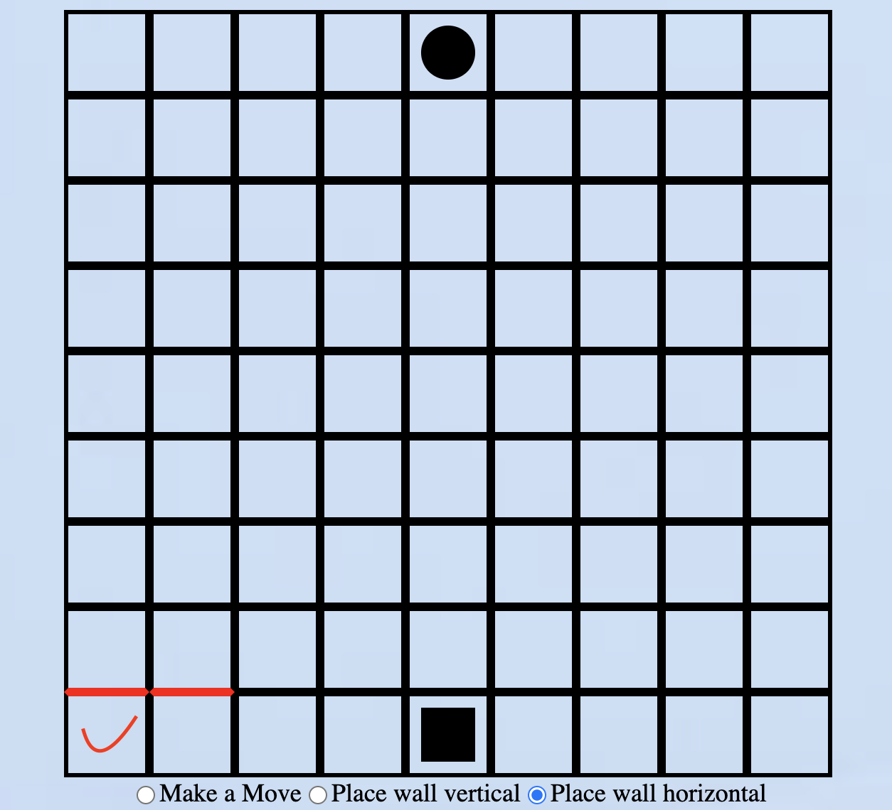
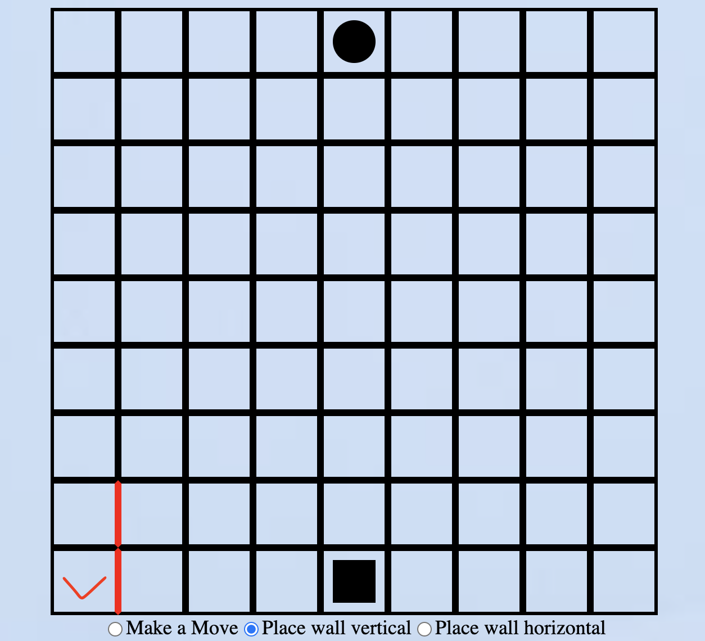
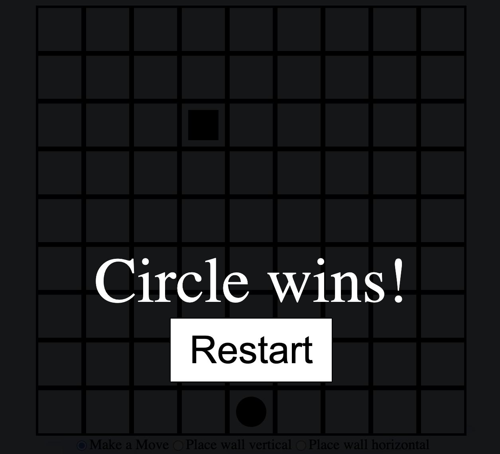

# A simple web game interface 

### Description
Circle and Square signals the two players, with Circle moving first. Radio buttons are used to specify movements. There are 
three kinds of movements possible in consistent with the coursework:

1. Make a move  
Move to one of the adjacent squares (does not support extensions like jump or diagonal). To carry out this step click the 
*Make a move* radio button and click on an adjacent square of the current player. If the move is valid then a step is made 
and turn swapped, if the move is invalid there will be no response until the player makes a valid move. 

2. Place a horizontal wall  
Click the *Place wall horizontal* radio button and click on a square, it will change the top border of the square and the square on the right to red. Effect is as follows (The tick represents the square selected):

Notice that in this case the wall action is invalid if the selected square is in the top row or the right most column.

3. Place a vertical wall  
Click the *Place wall vertical* radio button and click on a square, it will change the right border of the square and the square on top to red. Effect is as follows (The tick represents the square selected):

Notice that in this case the wall action is invalid if the selected square is in the top row or the right most column.

When the game finishes, an interface would pop up showing who wins and a button to restart the game. It looks like this:

### Notes
There is no No. of walls restriction set which means players can place any wall they like. 

Hope you enjoy it!